# Design Document: Horror Interactive Forms

## Overview

The Horror Interactive Forms feature transforms the ResurrectionStockPicker workflow inputs into an immersive, horror-themed experience. Users interact with predefined option cards styled as supernatural elements, complete with possession animations, glitch effects, and eerie visual feedback. The system maintains full functionality while delivering a terrifying yet accessible user experience across all 12 workflow steps.

## Architecture

```mermaid
graph TB
    subgraph "Horror Form System"
        HFC[HorrorFormContext] --> OCS[OptionCardSelector]
        HFC --> HRI[HorrorRangeInput]
        HFC --> HSS[HorrorStockSelector]
        HFC --> HPI[HorrorProgressIndicator]
        HFC --> HVF[HorrorValidationFeedback]
    end
    
    subgraph "Form Components"
        OCS --> RTC[RiskToleranceCards]
        OCS --> IHC[InvestmentHorizonCards]
        OCS --> IGC[InvestmentGoalCards]
        OCS --> RMC[RiskModelCards]
        HRI --> CRI[CapitalRangeInput]
        HRI --> PSI[PortfolioSizeInput]
        HSS --> SFC[ScreeningFilterCards]
        HSS --> SCC[StockCandidateCards]
    end
    
    subgraph "Animation System"
        AS[AnimationService] --> PA[PossessionAnimation]
        AS --> GA[GlitchAnimation]
        AS --> RA[ResurrectionAnimation]
        AS --> SA[SpiritAnimation]
    end
    
    subgraph "State Management"
        FS[FormState] --> VS[ValidationState]
        FS --> SS[SelectionState]
        FS --> PS[ProgressState]
    end
    
    HFC --> AS
    HFC --> FS
```



## Components and Interfaces

### HorrorFormContext

```typescript
interface HorrorFormContextValue {
  // Form state
  formData: Record<string, any>;
  setFormData: (key: string, value: any) => void;
  
  // Validation
  errors: Record<string, string>;
  validateField: (key: string, value: any) => boolean;
  isFormValid: boolean;
  
  // Progress
  completedSections: string[];
  currentSection: string;
  progressPercentage: number;
  
  // Horror effects
  triggerPossession: (elementId: string) => void;
  triggerGlitch: () => void;
  triggerJumpscare: (intensity: 'minor' | 'major') => void;
  triggerResurrection: (elementId: string) => void;
}
```

### OptionCardSelector

```typescript
interface OptionCard {
  id: string;
  value: string | number;
  label: string;
  description: string;
  icon: string;
  horrorIcon: string;
}

interface OptionCardSelectorProps {
  options: OptionCard[];
  value: string | number | null;
  onChange: (value: string | number) => void;
  multiSelect?: boolean;
  name: string;
  label: string;
  required?: boolean;
  horrorTheme: 'tombstone' | 'spirit' | 'cauldron' | 'treasure' | 'ritual';
}
```

### HorrorRangeInput

```typescript
interface RangeOption {
  id: string;
  label: string;
  minValue: number;
  maxValue: number | null;
  description: string;
}

interface HorrorRangeInputProps {
  ranges: RangeOption[];
  value: number | null;
  onChange: (value: number) => void;
  allowCustom?: boolean;
  customPlaceholder?: string;
  name: string;
  label: string;
  required?: boolean;
}
```

### HorrorStockSelector

```typescript
interface StockCandidate {
  ticker: string;
  companyName: string;
  sector: string;
  dividendYield: number;
  peRatio: number;
  metrics?: Record<string, number>;
}

interface HorrorStockSelectorProps {
  stocks: StockCandidate[];
  selectedTickers: string[];
  onSelect: (tickers: string[]) => void;
  multiSelect?: boolean;
  maxSelections?: number;
}
```

### HorrorProgressIndicator

```typescript
interface ProgressSection {
  id: string;
  label: string;
  isComplete: boolean;
  isActive: boolean;
}

interface HorrorProgressIndicatorProps {
  sections: ProgressSection[];
  currentSectionIndex: number;
  estimatedTimeRemaining?: number;
}
```

### HorrorValidationFeedback

```typescript
interface ValidationMessage {
  field: string;
  type: 'error' | 'warning' | 'success';
  message: string;
}

interface HorrorValidationFeedbackProps {
  messages: ValidationMessage[];
  showInline?: boolean;
  triggerJumpscare?: boolean;
}
```

## Data Models

### Form Configuration

```typescript
interface HorrorFormConfig {
  // Risk Tolerance Options
  riskToleranceOptions: OptionCard[];
  
  // Investment Horizon Options
  investmentHorizonOptions: OptionCard[];
  
  // Capital Range Options
  capitalRangeOptions: RangeOption[];
  
  // Investment Goal Options
  investmentGoalOptions: OptionCard[];
  
  // Screening Filter Options
  marketCapOptions: OptionCard[];
  dividendYieldOptions: RangeOption[];
  peRatioOptions: RangeOption[];
  sectorOptions: OptionCard[];
  
  // Risk Model Options
  riskModelOptions: OptionCard[];
  
  // Portfolio Size Options
  portfolioSizeOptions: RangeOption[];
  
  // Trade Options
  brokerOptions: OptionCard[];
  orderTypeOptions: OptionCard[];
  
  // Monitoring Options
  alertAppOptions: OptionCard[];
  reviewFrequencyOptions: OptionCard[];
  priceAlertOptions: RangeOption[];
}
```

### Form State

```typescript
interface HorrorFormState {
  // Step 1: Profile
  riskTolerance: 'low' | 'medium' | 'high' | null;
  investmentHorizonYears: number | null;
  capitalAvailable: number | null;
  longTermGoals: 'steady growth' | 'dividend income' | 'capital preservation' | null;
  
  // Step 4: Screening
  marketCap: 'large' | 'mid' | 'small' | null;
  dividendYieldMin: number | null;
  peRatioMax: number | null;
  sector: string | null;
  
  // Step 5-9: Stock Analysis
  selectedTicker: string | null;
  selectedTickers: string[];
  
  // Step 10: Position Sizing
  portfolioSize: number | null;
  riskModel: 'conservative' | 'balanced' | 'aggressive' | null;
  
  // Step 11: Trade
  brokerPlatform: string | null;
  orderType: 'market' | 'limit' | null;
  
  // Step 12: Monitoring
  alertApp: string | null;
  reviewFrequency: 'quarterly' | 'yearly' | null;
  priceDropPercent: number | null;
  priceGainPercent: number | null;
}
```

## Correctness Properties

*A property is a characteristic or behavior that should hold true across all valid executions of a system-essentially, a formal statement about what the system should do. Properties serve as the bridge between human-readable specifications and machine-verifiable correctness guarantees.*

### Property 1: Option Selection State Consistency
*For any* option card in any option group, when selected, the component state should reflect that exact value and only that value (for single-select) or include that value (for multi-select).
**Validates: Requirements 1.4**

### Property 2: Investment Horizon Value Mapping
*For any* investment horizon option selected, the stored integer value should correctly map to the option's defined year range (e.g., "1-3 years" → 2, "3-5 years" → 4, "5-10 years" → 7, "10+ years" → 15).
**Validates: Requirements 2.3**

### Property 3: Multi-Filter Selection Tracking
*For any* combination of screening filter selections across market cap, dividend yield, PE ratio, and sector, all selected values should be stored and visually indicated simultaneously.
**Validates: Requirements 5.6**

### Property 4: Stock Candidate Display Completeness
*For any* stock candidate provided to the selector, the rendered card should display both the ticker symbol and company name.
**Validates: Requirements 6.1**

### Property 5: Multi-Stock Selection Tracking
*For any* set of stocks selected by the user, all selected tickers should be tracked in state and visually indicated as selected.
**Validates: Requirements 6.5**

### Property 6: Position Sizing Calculation Correctness
*For any* valid portfolio size and risk model combination, the calculated position recommendations should follow the risk model's allocation rules (conservative: max 5% per position, balanced: max 10%, aggressive: max 20%).
**Validates: Requirements 7.4**

### Property 7: Required Field Validation
*For any* form submission with one or more missing required fields, the system should display error messages for each missing field and prevent submission.
**Validates: Requirements 10.1**

### Property 8: Form Validity and Submit Button State
*For any* form state, the submit button should be enabled if and only if all required fields have valid values.
**Validates: Requirements 10.4**

### Property 9: Inline Validation Feedback
*For any* field that receives user input, validation feedback should be displayed inline within a reasonable time after the interaction.
**Validates: Requirements 10.5**

### Property 10: Progress Indicator Accuracy
*For any* form state, the progress indicator should accurately reflect the ratio of completed sections to total sections.
**Validates: Requirements 11.1**

### Property 11: Keyboard Navigation Completeness
*For any* focusable element in the form, Tab navigation should reach it, and for any focused option card, Enter or Space should select it, and Arrow keys should navigate within option groups.
**Validates: Requirements 12.1, 12.2, 12.3**

## Error Handling

### Validation Errors
- Display skull icon with blood-red styling for missing required fields
- Trigger minor jumpscare effect for invalid data entry
- Show inline error messages with glitch text animation
- Prevent form submission until all errors are resolved

### Animation Errors
- Gracefully degrade to static styling if animations fail
- Log animation errors without disrupting user flow
- Provide fallback visual indicators for all animated states

### State Errors
- Maintain form state in local storage for recovery
- Display recovery prompt if state becomes corrupted
- Allow manual reset with confirmation dialog

## Testing Strategy

### Dual Testing Approach

This feature requires both unit tests and property-based tests:

**Unit Tests** verify specific examples and edge cases:
- Component rendering with specific props
- User interaction sequences
- Error state displays
- Animation trigger conditions

**Property-Based Tests** verify universal properties across all inputs:
- Selection state consistency across all option types
- Value mapping correctness for all horizon options
- Multi-select tracking for any combination of selections
- Validation behavior for any form state
- Progress calculation for any completion state

### Property-Based Testing Library

We will use **fast-check** for property-based testing in TypeScript/JavaScript.

### Test Configuration

- Each property-based test should run a minimum of 100 iterations
- Tests should be tagged with the format: `**Feature: horror-interactive-forms, Property {number}: {property_text}**`

### Test Categories

1. **Selection Properties**: Test that selections are correctly tracked and displayed
2. **Validation Properties**: Test that validation rules are consistently applied
3. **Progress Properties**: Test that progress calculation is accurate
4. **Accessibility Properties**: Test that keyboard navigation works correctly

