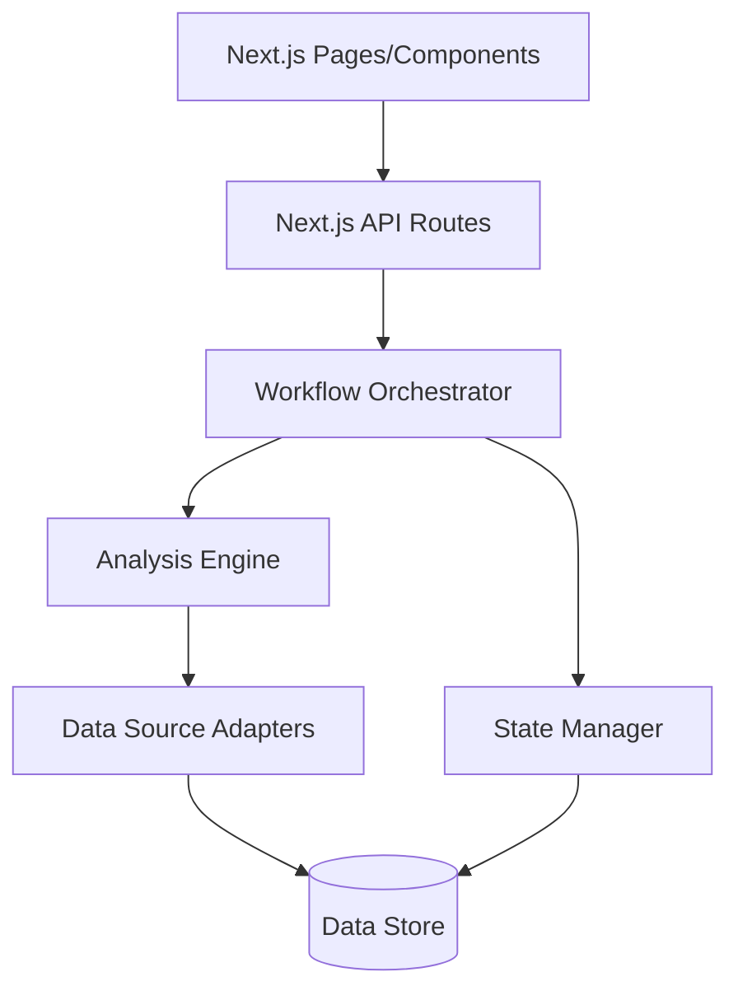
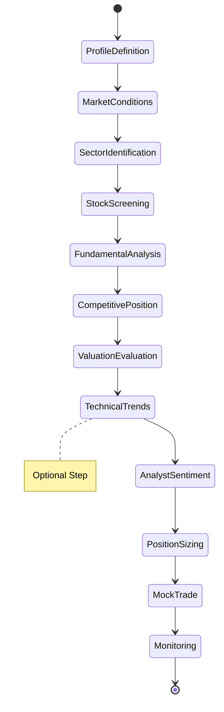

# Design Document: ResurrectionStockPicker

## Overview

The ResurrectionStockPicker is a workflow orchestration system that guides long-term investors through a 12-step research process. The system follows a pipeline architecture where each step produces outputs that feed into subsequent steps, creating a comprehensive investment research workflow from profile definition to trade execution and monitoring.

The design emphasizes:
- **Modularity**: Each workflow step is an independent, reusable component
- **Data aggregation**: Reliable data fetching from multiple authoritative sources
- **Educational focus**: Mock trading and clear disclaimers for learning purposes
- **Legacy aesthetics**: Classic value investing dashboard presentation

## Architecture

### High-Level Architecture

The system is built as a Next.js full-stack application with the following architecture:



### Component Layers

1. **Next.js Frontend**: React components for dashboard UI, forms, and data visualizations
2. **Next.js API Routes**: Server-side endpoints handling workflow operations
3. **Workflow Orchestrator**: Manages the 12-step pipeline, step transitions, and data flow
4. **Analysis Engine**: Performs calculations, scoring, and data transformations
5. **Data Source Adapters**: Interfaces to external data providers (SEC, Yahoo Finance, etc.)
6. **State Manager**: Tracks workflow progress and stores intermediate results
7. **Data Store**: PostgreSQL for persistence, Redis for caching (optional for MVP)

### Workflow Pipeline



## Components and Interfaces

### 1. Workflow Orchestrator

**Responsibilities:**
- Manage workflow state and step progression
- Validate step inputs and outputs
- Handle step dependencies and data passing
- Provide workflow status to UI

**Interface:**
```typescript
interface WorkflowOrchestrator {
  startWorkflow(userId: string): WorkflowSession
  executeStep(sessionId: string, stepId: number, inputs: StepInputs): Promise<StepOutputs>
  getWorkflowStatus(sessionId: string): WorkflowStatus
  skipOptionalStep(sessionId: string, stepId: number): void
  resetWorkflow(sessionId: string): void
}

interface WorkflowSession {
  sessionId: string
  userId: string
  currentStep: number
  completedSteps: number[]
  stepData: Map<number, StepOutputs>
  createdAt: Date
  updatedAt: Date
}

interface WorkflowStatus {
  sessionId: string
  currentStep: number
  totalSteps: number
  progress: number // 0-100
  canProceed: boolean
  nextStepRequirements: string[]
}
```

### 2. Step Processors

Each workflow step is implemented as a processor with a common interface:

**Interface:**
```typescript
interface StepProcessor {
  stepId: number
  stepName: string
  isOptional: boolean
  
  validateInputs(inputs: StepInputs): ValidationResult
  execute(inputs: StepInputs, context: WorkflowContext): Promise<StepOutputs>
  getRequiredInputs(): InputSchema[]
  getOutputSchema(): OutputSchema
}

interface WorkflowContext {
  sessionId: string
  userId: string
  previousStepData: Map<number, StepOutputs>
  userProfile?: InvestmentProfile
}
```

**Step Implementations:**
- `ProfileDefinitionProcessor` (Step 1)
- `MarketConditionsProcessor` (Step 2)
- `SectorIdentificationProcessor` (Step 3)
- `StockScreeningProcessor` (Step 4)
- `FundamentalAnalysisProcessor` (Step 5)
- `CompetitivePositionProcessor` (Step 6)
- `ValuationEvaluationProcessor` (Step 7)
- `TechnicalTrendsProcessor` (Step 8) - Optional
- `AnalystSentimentProcessor` (Step 9)
- `PositionSizingProcessor` (Step 10)
- `MockTradeProcessor` (Step 11)
- `MonitoringSetupProcessor` (Step 12)

### 3. Data Source Adapters

**Responsibilities:**
- Abstract external data source access
- Handle rate limiting and retries
- Cache responses where appropriate
- Transform external data to internal formats

**Interface:**
```typescript
interface DataSourceAdapter {
  sourceName: string
  
  fetch(request: DataRequest): Promise<DataResponse>
  isAvailable(): Promise<boolean>
  getRateLimit(): RateLimitInfo
}

// Specific adapters
interface SECEdgarAdapter extends DataSourceAdapter {
  fetchFilings(ticker: string, formType: string): Promise<Filing[]>
  searchCompany(query: string): Promise<CompanyInfo[]>
}

interface YahooFinanceAdapter extends DataSourceAdapter {
  fetchQuote(ticker: string): Promise<Quote>
  fetchSectorData(): Promise<SectorData[]>
  fetchCompanyProfile(ticker: string): Promise<CompanyProfile>
}

interface FinvizAdapter extends DataSourceAdapter {
  screenStocks(filters: ScreeningFilters): Promise<StockScreenResult[]>
}
```

**Adapter Implementations:**
- `SECEdgarAdapter`: SEC EDGAR filings
- `YahooFinanceAdapter`: Yahoo Finance data
- `FinvizAdapter`: Finviz stock screener
- `MorningstarAdapter`: Morningstar financial data
- `ReutersAdapter`: Reuters company profiles
- `SimplyWallStAdapter`: Simply Wall St valuations
- `TradingViewAdapter`: TradingView charts (optional)
- `TipRanksAdapter`: TipRanks analyst ratings
- `MarketBeatAdapter`: MarketBeat ratings
- `FederalReserveAdapter`: Fed economic data
- `CNBCAdapter`: CNBC economic news
- `BloombergAdapter`: Bloomberg market data

### 4. Analysis Engine

**Responsibilities:**
- Perform sector scoring and ranking
- Calculate valuation metrics
- Determine position sizing
- Generate moat analysis
- Aggregate analyst sentiment

**Interface:**
```typescript
interface AnalysisEngine {
  scoreSectors(sectorData: SectorData[], industryReports: IndustryReport[]): SectorRanking[]
  calculateValuations(fundamentals: Fundamentals, peerData: PeerData[]): ValuationMetrics
  determinePositionSize(profile: InvestmentProfile, stockPrice: number, riskModel: RiskModel): PositionSize
  analyzeMoat(companyProfile: CompanyProfile): MoatAnalysis
  aggregateAnalystSentiment(ratings: AnalystRating[]): AnalystSummary
}
```

### 5. State Manager

**Responsibilities:**
- Persist workflow sessions
- Store intermediate step results
- Track user profiles
- Manage research history

**Interface:**
```typescript
interface StateManager {
  createSession(userId: string): Promise<WorkflowSession>
  updateSession(sessionId: string, updates: Partial<WorkflowSession>): Promise<void>
  getSession(sessionId: string): Promise<WorkflowSession>
  
  saveStepData(sessionId: string, stepId: number, data: StepOutputs): Promise<void>
  getStepData(sessionId: string, stepId: number): Promise<StepOutputs>
  
  saveUserProfile(userId: string, profile: InvestmentProfile): Promise<void>
  getUserProfile(userId: string): Promise<InvestmentProfile>
  
  getSessionHistory(userId: string): Promise<WorkflowSession[]>
}
```

### 6. Dashboard UI

**Responsibilities:**
- Display workflow progress
- Collect user inputs for each step
- Visualize data (charts, tables, metrics)
- Present legacy-style research dashboard

**Key Views:**
- **Workflow Progress View**: Step-by-step progress indicator
- **Profile Setup View**: Form for investment profile
- **Market Overview View**: Economic indicators dashboard
- **Sector Analysis View**: Ranked sectors with scores
- **Stock Screener View**: Filterable stock list
- **Fundamentals View**: Financial metrics table
- **Moat Analysis View**: Competitive advantages breakdown
- **Valuation View**: Peer comparison charts
- **Technical Charts View**: Optional price charts
- **Analyst Consensus View**: Rating distribution
- **Position Sizing View**: Recommended allocations
- **Trade Confirmation View**: Mock trade summary
- **Monitoring Dashboard View**: Alerts and review schedule

## Data Models

### Core Domain Models

```typescript
// Step 1: Investment Profile
interface InvestmentProfile {
  userId: string
  riskTolerance: 'low' | 'medium' | 'high'
  investmentHorizonYears: number
  capitalAvailable: number
  longTermGoals: 'steady growth' | 'dividend income' | 'capital preservation'
  createdAt: Date
}

// Step 2: Macro Snapshot
interface MacroSnapshot {
  interestRate: number
  inflationRate: number
  unemploymentRate: number
  marketTrend: 'bullish' | 'bearish' | 'neutral'
  summary: string
  fetchedAt: Date
}

// Step 3: Sector Rankings
interface SectorRanking {
  sectorName: string
  score: number
  rationale: string
  dataPoints: {
    growthRate?: number
    marketCap?: number
    momentum?: number
  }
}

// Step 4: Stock Shortlist
interface StockCandidate {
  ticker: string
  companyName: string
  sector: string
  dividendYield: number
  peRatio: number
  marketCap: 'large' | 'mid' | 'small'
}

// Step 5: Fundamentals
interface Fundamentals {
  ticker: string
  revenueGrowth5y: number
  earningsGrowth5y: number
  profitMargin: number
  debtToEquity: number
  freeCashFlow: number
  analyzedAt: Date
}

// Step 6: Moat Analysis
interface MoatAnalysis {
  ticker: string
  patents: string
  brandStrength: string
  customerBase: string
  costLeadership: string
  overallMoatScore?: number
}

// Step 7: Valuations
interface ValuationMetrics {
  ticker: string
  peRatio: number
  pbRatio: number
  vsPeers: string
  fairValueEstimate?: number
}

// Step 8: Technical Signals (Optional)
interface TechnicalSignals {
  ticker: string
  trend: 'upward' | 'downward' | 'sideways'
  maCross: boolean
  rsi?: number
  analyzedAt: Date
}

// Step 9: Analyst Ratings
interface AnalystSummary {
  ticker: string
  buyCount: number
  holdCount: number
  sellCount: number
  averageTarget: number
  consensus: 'strong buy' | 'buy' | 'hold' | 'sell' | 'strong sell'
}

// Step 10: Position Sizing
interface BuyRecommendation {
  ticker: string
  sharesToBuy: number
  entryPrice: number
  orderType: 'market' | 'limit'
  totalInvestment: number
  portfolioPercentage: number
}

// Step 11: Trade Confirmation
interface TradeConfirmation {
  ticker: string
  quantity: number
  price: number
  confirmationId: string
  executedAt: Date
  isMock: boolean
}

// Step 12: Monitoring Plan
interface MonitoringPlan {
  ticker: string
  priceAlertsSet: boolean
  earningsReviewPlanned: boolean
  reviewFrequency: 'quarterly' | 'yearly'
  nextReviewDate: Date
  alertThresholds?: {
    priceDropPercent?: number
    priceGainPercent?: number
  }
}
```

### Workflow Data Model

```typescript
interface StepInputs {
  [key: string]: any
}

interface StepOutputs {
  [key: string]: any
  success: boolean
  errors?: string[]
  warnings?: string[]
}

interface ScreeningFilters {
  marketCap?: 'large' | 'mid' | 'small'
  dividendYieldMin?: number
  peRatioMax?: number
  sector?: string
  minPrice?: number
  maxPrice?: number
}

interface RiskModel {
  type: 'conservative' | 'balanced' | 'aggressive'
  maxPositionSize: number // percentage of portfolio
  diversificationMin: number // minimum number of positions
}
```

## Error Handling

### Error Categories

1. **Validation Errors**: Invalid user inputs or missing required data
2. **Data Source Errors**: External API failures, rate limits, timeouts
3. **Analysis Errors**: Calculation failures, insufficient data
4. **State Errors**: Session not found, corrupted data

### Error Handling Strategy

```typescript
interface ErrorHandler {
  handleError(error: Error, context: ErrorContext): ErrorResponse
  logError(error: Error, context: ErrorContext): void
  shouldRetry(error: Error): boolean
}

interface ErrorResponse {
  userMessage: string
  technicalDetails?: string
  canContinue: boolean
  suggestedAction: string
  retryable: boolean
}

interface ErrorContext {
  sessionId: string
  stepId: number
  operation: string
  timestamp: Date
}
```

**Error Handling Rules:**
- Data source failures: Retry up to 3 times with exponential backoff
- Validation errors: Return immediately with clear user message
- Partial data: Continue with warnings if minimum data threshold met
- Critical failures: Halt workflow and preserve state for recovery
- All errors logged for debugging and monitoring

### Fallback Strategies

- **Missing macro data**: Use cached data with staleness warning
- **Sector data unavailable**: Allow manual sector selection
- **Stock screening timeout**: Return partial results with continuation option
- **Analyst data missing**: Proceed without sentiment analysis
- **Technical analysis unavailable**: Skip optional step automatically

## Testing Strategy

### Unit Testing

**Scope:**
- Individual step processors
- Analysis engine calculations
- Data transformations
- Validation logic

**Approach:**
- Mock external data sources
- Test edge cases (zero values, missing data, extreme values)
- Verify error handling paths
- Test calculation accuracy

### Integration Testing

**Scope:**
- Workflow orchestration
- Step-to-step data flow
- State persistence
- Data source adapter integration

**Approach:**
- Use test data sources with known responses
- Verify complete workflow execution
- Test workflow interruption and resumption
- Validate data consistency across steps

### End-to-End Testing

**Scope:**
- Complete user workflows
- UI interactions
- Real data source integration (in test environment)

**Approach:**
- Simulate user journey through all 12 steps
- Test with various investment profiles
- Verify dashboard displays
- Test optional step skipping

### Test Data

- **Mock investment profiles**: Conservative, balanced, aggressive investors
- **Sample market data**: Bull, bear, and neutral market conditions
- **Test stock universe**: 20-30 representative stocks across sectors
- **Analyst data fixtures**: Various rating distributions
- **Edge cases**: Stocks with missing data, extreme valuations, negative growth

### Performance Testing

**Metrics:**
- Step execution time (target: < 5 seconds per step)
- Data source response time (target: < 3 seconds)
- Workflow completion time (target: < 2 minutes for all steps)
- Concurrent user capacity (target: 100 simultaneous workflows)

## Implementation Notes

### Technology Considerations

- **Framework**: Next.js 14+ with App Router for full-stack development
- **Language**: TypeScript for type safety across frontend and backend
- **Data Storage**: PostgreSQL for structured data (via Prisma ORM)
- **Session Management**: Next.js built-in session handling or NextAuth
- **API Layer**: Next.js API Routes (app/api directory)
- **Data Fetching**: Server-side fetching in API routes with retry logic
- **Caching**: Next.js built-in caching, optional Redis for advanced caching
- **UI Components**: React Server Components and Client Components
- **Styling**: Tailwind CSS for legacy-style dashboard aesthetics
- **Scheduling**: Vercel Cron or node-cron for monitoring alerts

### Security Considerations

- **API Keys**: Secure storage for data source credentials
- **User Data**: Encryption at rest for investment profiles
- **Rate Limiting**: Prevent abuse of external data sources
- **Input Validation**: Sanitize all user inputs
- **Audit Logging**: Track all workflow executions and data access

### Compliance and Disclaimers

- Display educational disclaimer on every page
- No actual trade execution (mock only)
- Clear labeling of data sources and timestamps
- Disclosure of data limitations and potential inaccuracies
- User acknowledgment required before starting workflow

### Future Enhancements

- Portfolio tracking across multiple workflow sessions
- Historical performance analysis of recommendations
- Custom screening criteria builder
- Export research reports to PDF
- Integration with paper trading platforms
- Backtesting capabilities
- Social features (share research, compare strategies)
